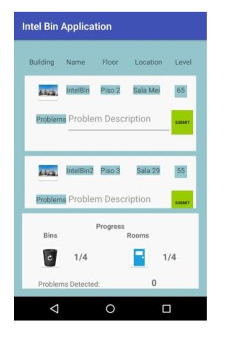

# IntelBinApp
Mobile Application

Project for Ubiquitous computer course, giving the possibility of managing the fill level of different trash cans, automating the recovery task by the clearing clerks.

